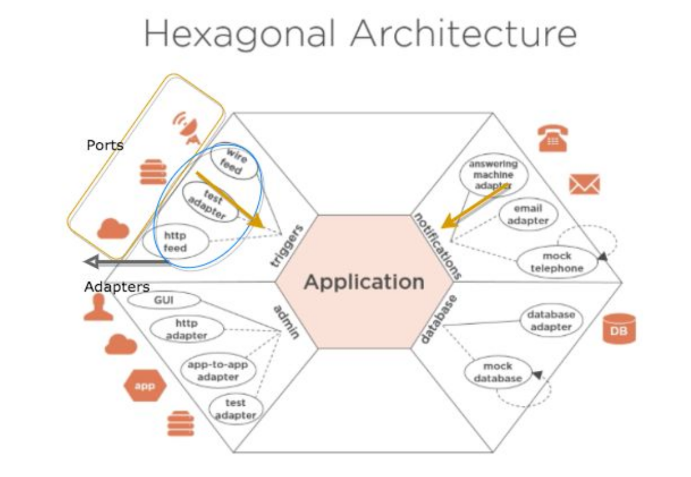

# O que é DESIGN PATTERNS

**Uma solução para um problema que existe (só aplicar quando o problema existir)**

<b>Caso de Uso:</b> Imagine um cruzando gerando alto índice de acientes, quais design patterns poderiam ser aplicados? 
 - <b>Semáforo:</b> É um padrão da industria então pode ser considerado um design-pattern, é muito utilizado no cruzamento de apenas 2(duas) ruas e tem custo baixo.
 - <b>Rotatória:</b> É um padrão da industria então pode ser considerado um design-pattern, é muito utilizado no cruzamento de várias vias e tem custo elevado.

# GUIDELINE

Hexagonal além de ser um Design Pattern é um guideline, ou seja uma diretriz, traz principios pré-definidados onde o objetivo é colher resultados previamente direcionados. 

# Para que serve?

Projetar e construir aplicativos de software, estabelecendo uma arquitetura moderna, robusta e altamente flexível, orientadas pelas premissas básicas da filosofia de desenvolvimento ágil:

1. Desenvolvimento orientado a TDD.

2. Foco nos requisitos de negócio.

3. Adiar decisões técnicas o máximo possível.

# Quando surgiu?

Elaborado e documentado em 2005 por Alistair Cockburn (https://en.wikipedia.org/wiki/Alistair_Cockburn)

- Um dos autores do manifesto agil 2001.

- Autor da metodologia Cristal Clear.

Foi idealizado para que as equipes de desenvolvimento pudessem aplicar ideias/premissas de ágil na elaboração da arquitetura de software. Perdeu força nos anos seguintes mas ressurgiu como um interesse global a partir de 2015.

# Qual objetivo?

Foco no requisito de negócio, ignorando dependências externas técnicas e infra estruturais (ex: interface grafica e banco de dados). A ideia é criar uma arquitetura que possa ser executada por usuários, programas e testes automatizados.
Essa arquitetura também é chamada de "Port and Adapters Patterns".

# Arquitetura Hexagonal

# Isolamento

A arquitetura hexagonal aplica <b>SoC(Separation of concerns)</b> e estabelece o princípio de modularizar a solução em <b>3 áreas distintas e isoladas:</b>

1. Centro como hexágono 
   - Toda a Lógica de negocio.
   - Pode conter código Orientado a Objetos, Orientado a Aspectros ou  Programação funcional.
   - Totalmente agnostico a qualquer tecnologia, framewark e infraestrutura de interfaces (gráficas, comunicações) e dispositivos externos.
   - Pode ter dependências de framewarks de serviços gerais, ex: Logg, IoC etc.
   

2. Lado superior esquerdo, fora do hexágono
   - Lado intercambiável e flexível
   - Onde o ator externo irá interagir e estimular a solução
   - Conterá <b>código de tecnologia específica</b> que irá disparar eventos na solução.

3. Lado inferior direito, fora do hexágono.
   - Lado intercambiável e flexível
   - Fornecerá os <b>serviços de infraestrutura</b> que a solução precisa para existir.
   - Conterá <b>código de tecnologia específica</b>, normalmente código que interage com o banco de dados, faz chamadas http etc. 

