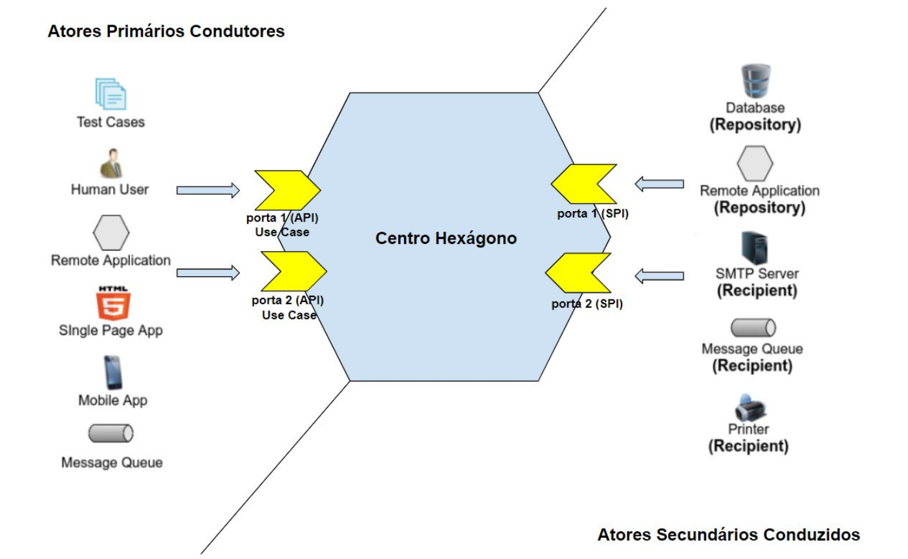
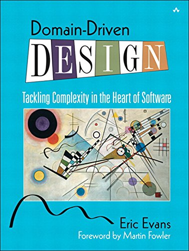

# O que é DESIGN PATTERNS

**Uma solução para um problema que existe (só aplicar quando o problema existir)**

<b>Caso de Uso:</b> Imagine um cruzando gerando alto índice de acientes, quais design patterns poderiam ser aplicados? 
 - <b>Semáforo:</b> É um padrão da industria então pode ser considerado um design-pattern, é muito utilizado no cruzamento de apenas 2(duas) ruas e tem custo baixo.
 - <b>Rotatória:</b> É um padrão da industria então pode ser considerado um design-pattern, é muito utilizado no cruzamento de várias vias e tem custo elevado.

# GUIDELINE

Hexagonal além de ser um Design Pattern é um guideline, ou seja uma diretriz, traz principios pré-definidados onde o objetivo é colher resultados previamente direcionados. 

# Para que serve?

Projetar e construir aplicativos de software, estabelecendo uma arquitetura moderna, robusta e altamente flexível, orientadas pelas premissas básicas da filosofia de desenvolvimento ágil:

1. Desenvolvimento orientado a TDD.

2. Foco nos requisitos de negócio.

3. Adiar decisões técnicas o máximo possível.

# Quando surgiu?

Elaborado e documentado em 2005 por Alistair Cockburn (https://en.wikipedia.org/wiki/Alistair_Cockburn)

- Um dos autores do manifesto agil 2001.

- Autor da metodologia Cristal Clear.

Foi idealizado para que as equipes de desenvolvimento pudessem aplicar ideias/premissas de ágil na elaboração da arquitetura de software. Perdeu força nos anos seguintes mas ressurgiu como um interesse global a partir de 2015.

# Qual objetivo?

Foco no requisito de negócio, ignorando dependências externas técnicas e infra estruturais (ex: interface grafica e banco de dados). A ideia é criar uma arquitetura que possa ser executada por usuários, programas e testes automatizados.
Essa arquitetura também é chamada de "Port and Adapters Patterns".

# Arquitetura Hexagonal

# Isolamento

A arquitetura hexagonal aplica <b>SoC(Separation of concerns)</b> e estabelece o princípio de modularizar a solução em <b>3 áreas distintas e isoladas:</b>

1. Centro como hexágono 
   - Toda a Lógica de negocio.
   - Pode conter código Orientado a Objetos, Orientado a Aspectros ou  Programação funcional.
   - Totalmente agnostico a qualquer tecnologia, framewark e infraestrutura de interfaces (gráficas, comunicações) e dispositivos externos.
   - Pode ter dependências de framewarks de serviços gerais, ex: Logg, IoC etc.
   

2. Lado superior esquerdo, fora do hexágono
   - Lado intercambiável e flexível
   - Onde o ator externo irá interagir e estimular a solução
   - Conterá <b>código de tecnologia específica</b> que irá disparar eventos na solução.

3. Lado inferior direito, fora do hexágono.
   - Lado intercambiável e flexível
   - Fornecerá os <b>serviços de infraestrutura</b> que a solução precisa para existir.
   - Conterá <b>código de tecnologia específica</b>, normalmente código que interage com o banco de dados, faz chamadas http etc.

# Atores

Fora do hexágono, temos qualquer coisa do mundo real com a qual o aplicativo interage. Essas coisas incluem seres humanos, outros aplicativos ou qualquer dispositivo de hardware ou software. Eles são chamados de atores.

1. Ator Primário Condutor
   - A interação é acionada pelo ator. 
   - É aquele que interage com o aplicativo para atingir um objetivo. Exemplos: Suites de test

2. Ator Secundário Conduzido
   - A interação é acionada pelo hexágono. 
   - Um ator secundários fornece funcionalidades necessárias ao hexágono para processar a lógica de negócios.
     Exemplos: banco de dados relacionais, nosql, serviços web http, stmp, sistema de arquivos e etc.

# Dependências

A arquitetura hexagonal estabelece o seguinte princípio de dependências: "<b>somente de fora para dentro!</b>":

1. Lado esquerdo, os atores primários dependem do hexágono.

2. Lado direito, os atores secundários dependem do hexágono.

3. O centro, o hexágono não depende de ninguém, só dele mesmo.

# Portas

Hexagono 100% Isolado, a comunicação "de fora para dentro" deve ser feito através de uma metáfora chamada "porta". 

1. Portas primárias Condutor (Driver)
   - São os <b>casos de uso</b>. 
   - Devem estar <b>dentro do hexágono</b>.
   - Agnósticos a tecnologias.
   - Redirecionam as chamadas externas para dentro das operações de negócio.

2. Portas secundárias Conduzida (Driven)
   - Devem estar <b>fora do hexágono</b>.
   - Utilizam <b>tecnologia específica</b>.
   - Convertem chamada de negócio em alguma necessidade infraestrutural e externa a solução.

# Adaptadores

Funcionam como um <b>"adaptador de tomada"</b> que fazem <b>"ponte"</b> para o que <b>hexágono</b> possa ter input de dados do lado esquerdo e ter acesso aos serviços de infraestrutura do lado direito. 

1. Adaptador Condutor (Driver)
   - Converte uma <b>solicitação de tecnologia específica</b> em uma <b>solicitação agnóstica e pura de sistema</b>.
   - Faz integração do lado <b>de fora para dentro</b> do hexágono.
   - São classes OOP que usam <b>frameworks e tecnologias específicas</b>.
   - Repassam as operações para a porta primária.
   - Para cada porta condutora, deve haver pelo <b>menos dois adaptadores</b> (um para testar o comportametno via TDD e outro usando tecnologia real).
   Ex: Suite de testes, GUI de um aplicativo, Fila de Mensageria, Classes de teste junit, etc...

2. Adaptador Conduzido (Driven)
   - Converte chamadas <b>de dentro da solução para fora</b>
   - Faz integração <b>de dentro para fora</b> do hexágono.
   - São classes OOP que usam <b>frameworks e tecnologias específicas</b>.
   - Para cada porta conduzida, dev haver pelo <b>menos dois adaptadores</b> (um para o dispositivo do mundo real e outro simulado/mock)
   Ex: Classe DAO via JDBC, Classes cliente consumidor de um rest, Classe envio de sms, etc ...
   
   

# Fluxo de Execução

<b>Na teroria</b>

1. Lado esquerdo, os atores primários dependem do hexágono.

2. Lado direito, os atores secundários dependem do hexágono.

3. O centro, o hexágono não depende de ninguém, só dele mesmo.

<b>Na prática</b>

1. O centro, o <b>hexágono depende do lado direito</b>.

2. Lado direito, os <b>atores secundários não dependem</b> do hexágono.

<b>Como resolver isso?</b>

<b>Inversão de Controle (Inversion of Control - IoC)</b>

É um padrão arquitetural, uma técnica de arquitetura de software usada para <b>inverter uma linha de dependência em um bloco arquitetural</b>. Se o componente A [->depende->] B, usando IoC é possível fazer inverter a seta, fazendo com que A [<- dependa IoC<-] B. 

A arquitetura hexagonal aplica IoC, estabelecendo o princípio modular que <b>o lado de fora direito tem dependência ao hexágono via IoC!</b>

   
   
# Opções de Design?

<b>Você fica livre para organizar</b> seu projeto de forma que quiser, balanceando os <b>prós e contras</b> de cada opção, usando seu <b>know-how</b> e <b>os recursos</b> que sua plataforma oferece, desde que: cada opção não <b>fure</b> os princípios hexagonal.

<b>Organização do Projeto</b>

1. Um projeto com os 3 módulos, separado por pacotes simples.
2. Um projeto com os 3 módulos, separado por java modules 9.
3. Três projetos diferentes, uma para cada módulo, usado jar manual.
4. Três projetos diferentes, uma para cada módulo, usando jar via maven system.
5. Três projetos diferentes, uma para cada módulo, usando jar via maven repositorio local jfrog - https://jfrog.com/open-source/
7. N projetos diferentes, uma para cada módulo, um para cada front-end, um para cada back-service: database, nosql, sms, webservice etc, usando jar manual, maven system ou maven repositório local jfrog.

<b>Organização de Pacotes</b>

1. Por tipos (Type)
2. Por camada (Layer)
3. Por serviço (Feature)
4. Por metáforas hexagonal (Ports, Adapters, etc)
5. Miscelânea

<b>Implementação das regras de negócio dentro do hexágono</b>

1. Transactions Script - EAA Pattern (https://martinfowler.com/eaaCatalog/transactionScript.html).

2. Domain Model - EAA Pattern (https://martinfowler.com/eaaCatalog/domainModel.html).

3. Service Layer - EAA Pattern (https://martinfowler.com/eaaCatalog/serviceLayer.html).

4. Anemic Domain Model - EAA Pattern (https://martinfowler.com/bliki/AnemicDomainModel.html).

5. Domain Driven Design - DDD (Eric Evans - https://www.oreilly.com/library/view/domain-driven-design-tackling/0321125215/).

6. Clean Architecture - Entities e Use Cases (Uncle Bob - https://blog.cleancoder.com/uncle-bob/2012/08/13/the-clean-architecture.html).

<b>Organização as Portas Primárias -  Casos de Usos</b>

   - Uma porta primária é uma interface que você vai colocar para fora do hexágono.

   - Alguma classe controladora dentro do hexágono vai implementar e responder por aquela interface.
 
 
 Existem formas diferentes de como que você expõe isso:
 
 1. Uma única interface com várias operações distintas (Utilizada em projetos menores).
   Ex: 4 regras de negócios distintas e uma única interface

 2. Várias interfaces, cada uma agrupando operações relacionadas.
   Ex: Hexágono faz venda, compra e aluguel. Você vai ter uma interface para cada com seu eventos (Venda->verPreco, Venda->gerarOrcamento) 

 3. Uso do padrão de projeto: Command Bus (Interfaces dinâmicas e flexíveis)
    - Usado em operações que contém alterações.
    - Forma dinâmica em tempo de execução para descobrir o que o usuário de fora está querendo fazer (Programação diânica ou Reflection).

 4. Uso do padrão de projeto: Command Query (Interfaces dinâmicas e flexíveis). 
    - Usado em operações que contém apenas resposta de consulta e não vai alterar nada.
    - Forma dinâmica em tempo de execução para descobrir o que o usuário de fora está querendo fazer (Programação diânica ou Reflection).

# Quando não usar?

Projetos <b>temporais</b>, de <b>menor porte</b> ou <b>legados</b>, no qual não se tenha previsão de alteração de tipo de front-end ou de back services.

Projetos que fazem uso de <b>regras de negócio dentro de banco de dados</b>, amarrados na tecnologia, marca e provedor proprietário.

# Quando usar?

Projetos de <b>médio</b> e <b>grande porte</b>, que supostamente possuem um <b>longo ciclo de vida</b>, e que precisaram ser modificados muitas vezes durante sua vida útil, que sofreram de <b>erosão arquitetural</b> e <b>dívida técnica</b>.
Pois em curto prazo, o investimento se reverte em lucro pela quantidade e velocidade das mudanças.

Projetos de <b>qualquer porte</b> que precisam ser desenvolvidos sem <b>amarrações</b> com <b>front-end</b> e <b>back services</b>.

# Conclusão

Não existe bala de prata. A arquitetura hexagonal tem se destacado como uma ótima opção de arquitetura, pois o custo é baixo (poucos pontos negativos) e retorno é alto é rápido (muitos pontos positivos).

É uma das várias opções de padrões arquiteturais encontradas no mercado hoje: DDD, Onion e Clean Architecture.

Analise cada um e faça sua decisão baseada em prós e contras, contexto e necessidade.

# BIBLIOGRAFIA

